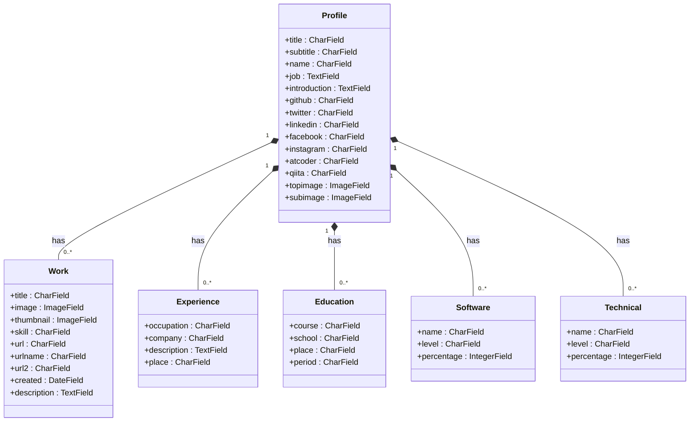

```mermaid
classDiagram
    Profile "1" *-- "0..*" Work : has
    Profile "1" *-- "0..*" Experience : has
    Profile "1" *-- "0..*" Education : has
    Profile "1" *-- "0..*" Software : has
    Profile "1" *-- "0..*" Technical : has
    class Profile {
        +title : CharField
        +subtitle : CharField
        +name : CharField
        +job : TextField
        +introduction : TextField
        +github : CharField
        +twitter : CharField
        +linkedin : CharField
        +facebook : CharField
        +instagram : CharField
        +atcoder : CharField
        +qiita : CharField
        +topimage : ImageField
        +subimage : ImageField
    }
    class Work {
        +title : CharField
        +image : ImageField
        +thumbnail : ImageField
        +skill : CharField
        +url : CharField
        +urlname : CharField
        +url2 : CharField
        +created : DateField
        +description : TextField
    }
    class Experience {
        +occupation : CharField
        +company : CharField
        +description : TextField
        +place : CharField
    }
    class Education {
        +course : CharField
        +school : CharField
        +place : CharField
        +period : CharField
    }
    class Software {
        +name : CharField
        +level : CharField
        +percentage : IntegerField
    }
    class Technical {
        +name : CharField
        +level : CharField
        +percentage : IntegerField
    }
```
